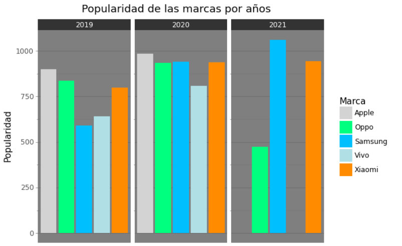

# Análisis de ventas y la popularidad de las principales empresas y sus dispositivos móviles.

#### Integrantes: Paul Rojas y Benjamín Robles
#### Profesora: Carolina Lagos

## Introducción

En el presente trabajo se analizarán dos datasets con el objetivo de responder a las hipótesis planteadas, los cuales 
han sido obtenidos del sitio web _"Kaggle"_. Se puede acceder a estos desde los siguientes sitios web.

[Global Smartphone Shipments (in Mn)](https://www.kaggle.com/datasets/stevieadrianus/global-smartphone-shipments-in-mn)

[Mobile Phones Data](https://www.kaggle.com/datasets/artempozdniakov/ukrainian-market-mobile-phones-data)

Como se puede apreciar a simple vista estos dataset poseen información acerca de las ventas globales de las ventas por trimestre de las principales compañías. Las cuales son Apple,
Samsung, Xiaomi, Oppo y Vivo. Además del resto del mercado.

El segundo dataset a analizar posee información variada acerca
del mercado de smartphones presente en Ucrania, el cual posee información por equipo, como por ejemplo su precio, su popularidad, así como sus prestaciones.

## Hipotesis

Creemos que aquellas marcas que generan mayor índice de
ganancias tienen una mayor popularidad entre sus dispositivos. 

Además, consideramos que existe una correlación entre la cantidad de
equipos vendidos en promedio por marca y la popularidad de
esta misma. 

## Preparación de la información

Para iniciar nuestro análisis realizamos un cruce entre los
datasets seleccionados con el objetivo de tener una data más
completa.

Como la cantidad de información disponible es limitada, nos
concentraremos en las cinco compañias con mayores ventas hasta
el primer trimestre del 2021 (2021Q1), las cuales vienen siendo

- Oppo
- Samsung
- Apple
- Xiaomi
- Vivo

Como la fuente de los datasets obtenidos es distinta es 
necesario realizar algunos cambios a los datasets con el fin
de facilitar el cruce. Tales como descartar aquellas marcas o períodos de tiempo de los cuales no poseemos información.

Concretamente, trabajaremos con toda información que vaya 
desde el primer trimestre del 2018 hasta el primer trimestre
del 2021. (ambos incluídos). Del análisis del mercado de 
Ucrania tomaremos solamente la marca, el precio y la popularidad
de los dispositivos. Es decir las columnas `popularity, brand_name, best_price, release_date`.

### Problemas enfrentados en el cruce de datos

A la hora de preparar esta data nos topamos con diversas complicaciones. Fue necesario convertir la divisa Ucraniana en 
dólares para facilitar la lectura de la información, esto fue fácil ya que solo requería multiplicar en cada fila el valor 
de cada dispositivo por el costo de esta divisa en dólares. 
Nuestra segunda complicación fue no tener una columna común por
la cual poder realizar un cruce de información significativo. 

Para comenzar pivoteamos el dataset de las ventas en millones
por empresa, puesto que en una primera instancia este estaba dispuesto de manera que las columnas representaban los periodos
de tiempo y las filas las marcas correspondientes, este proceso 
fue realizado de manera automática con el método de la librería
"Pandas" `DataFrame.melt()`.

Luego de esta operación ya nos era posible graficar la 
información proporcionada por el dataset. Sin embargo esto 
aún no era suficiente para realizar el cruce de datos. Pues 
uno de los datasets estaba organizado en trimestres, mientras
que el otro poseía la fecha de lanzamiento de los celulares. 
Por lo que el siguiente paso fue convertir esta fecha al 
trimestre correspondiente. Para esto fue necesario convertir
la columna `release_date` en un formato con el que pandas puede
trabajar. Para esto utilizamos la función 
`Pandas.to_datetime()`. Luego de esto se creó una nueva 
columna `quarter` con la función `Pandas.PeriodIndex()`. La cual recibía por argumento la columna anteriormente 
transformada `release_date`.

A este punto ya poseíamos una columna común entre los datasets.
Sin embargo en uno de estos la información en las filas estaba
distribuída por equipo, mientras que la otra esta se encontraba
distribuida por marca. Para que la distribución de los datos fuera similar, agrupamos los dispositivos por marca utilizando
el método de pandas `DataFrame.groupby()`. La cual calcula 
un promedio de las columnas `best_price` y `popularity` Guiándose por la marca de los dispositivos y el trimestre 
correspondiente a la fecha de lanzamiento.

El último paso para realizar el cruce de datos fue 
convertir la columna `Quarter` de la data de las ventas en 
millones en el formato común de pandas. Esto fue realizado 
con la misma función utilizada anteriormente `Pandas.PeriodIndex()`.

Posteriormente nos dimos cuenta que algunas marcas presentaban un formato de nombre distinto. Como por ejemplo en un dataset
encontrabamos la marca "Oppo" con todas sus letras en mayúsculas
y en otro con tan solo la primera letra en mayúsculas. Por lo 
que decidimos trabajar con el formato común de dejar tan solo 
la primera letra en mayúsculas. Esto fue solucionado con un 
"Buscar y reemplazar" antes de importar el archivo realizado con el editor de flujo `sed`. Herramienta presente en la mayoría de sistemas -nix.

# Análisis exploratorio

Una vez realizado el cruce nos fue posible realizar los siguientes gráficos:

- Samsung es el principal ganador en ventas por millones de dólares.

- Xiaomi tiene la mayor alza en ganancia.

- Samsung es el principal ganador en ventas.

- Xiaomi es el que tiene mayor alza en ganancias

- Apple tiene mejores resultados en el 2021

- Samsung se encuentra más bajo pero presenta un alza.
- Xiaomi tiene la mayor alza en popularidad.
- Apple presenta mejores resultados en la popularidad.

- En el rango inferior
    - Oppo sobresale junto a Xiaomi
- En el rango medio
    - Vivo y Apple son aquellos con mejor valoración.
- En el rango superior
    - Apple es el con mejor valoración.

- La tendencia es a un precio de celular bajo. 
- Los equipos caros son una minoría

- Samsung tiene una tendencia bajista en unidades vendidas
- Xiaomi presenta un alza en sus ventas por unidades.

- Samsung es la principal marca en ventas de celulares de bajo costo

- Samsung se encuentra más alto pero con una tendencia bajista.
- Xiaomi tiene una tendencia alcista.

- En Q1 y Q2 Samsung y Xiaomi son los más populares
- En Q3 y Q4 Apple y Xiaomi son los más populares

- La tendencia es a que las empresas vendan pocas unidades. Esto puede deberse a la influencia de los equipos con costo elevado.

# Conclusiones

_"La marca con mayor ganancias son aquellas que tienen un mayor ranking de popularidad entre sus equipos."_

Esto no es necesariamente cierto, pues Xiaomi y Apple son aquellas 
que lideran en popularidad mientras que generan menores ventas que otras como Samsung. Esto es debido a que Samsung tiene mayor variedad de equipos y prioriza sus equipos de bajo costo, a diferencia de Apple.
Estos equipos venden más pero generan una menor satisfacción en el cliente

_"La marca que más unidades de equipos vende al año es aquella 
que genera un mayor índice de ganancia y la más popular"_.

De los gráficos podemos observar que, en términos del promedio
de ventas por unidades Xiaomi se encuentra al alza, del mismo modo es una de las marcas con mejores índices de popularidad. 

Samsung es la empresa que más equipos tiene a la venta y la 
que más equipos vende, sin embargo su promedio de popularidad
no destaca tanto como el de las otras marcas. A su vez, Apple
tiene un mayor índice de popularidad y una menor cantidad de 
ventas por unidad.
